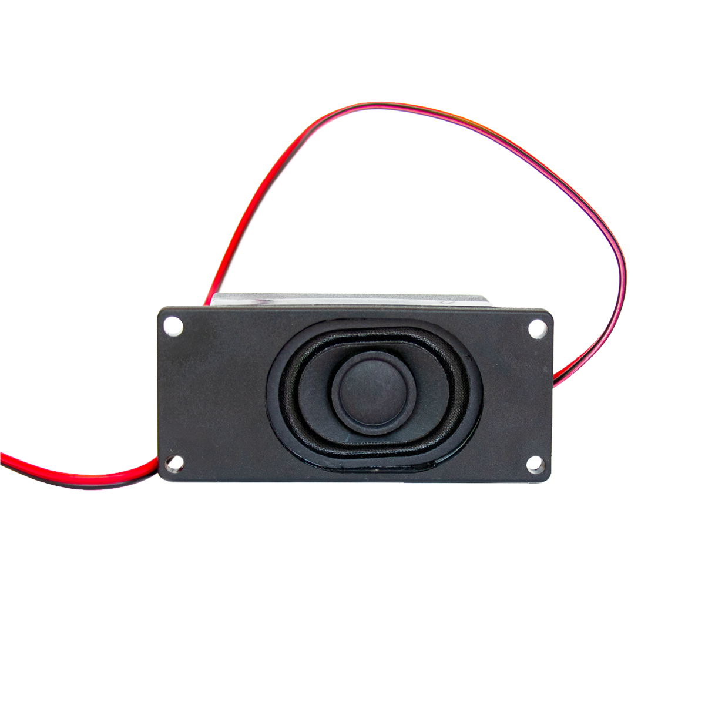

# Lautsprecher

## Beschreibung
Dieser Lautsprecher ermöglicht das Ausgeben jeder Art von Geräuschen durch ein Abspielgerät, beispielsweise einem MP3-Modul. Der Lautsprecher wird direkt mit dem Kabel an ein MP3-Modul angeschlossen und kann so die Audiosignale übertragen.

Die genaue Bezeichnung des Lautsprechers, die bei der Suche von Beschreibungen und Anleitungen wichtig sein kann, lautet Mono Enclosed Speaker with Plain Wires - 3W 4 Ohm.

## Beispiele

!!!show-examples:./examples/

<!-- infolist -->

